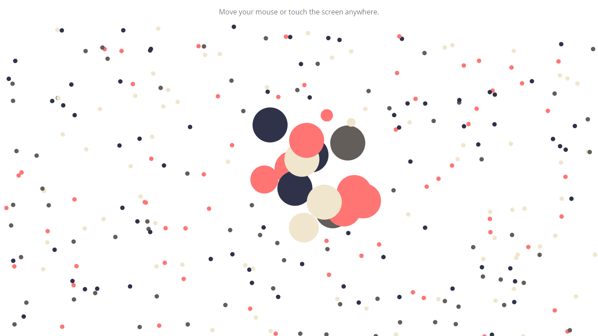

# Basic-Canvas-Interaction
In this project, we'll see how to interact with the HTML5 Canvas to create some awesome animations.

* The canvas consists of numerous bubbles objects floating around and bouncing off the screens.
* Bubbles near the mouse or touch position will enlarge to give some stunning animation.

### Screenshot

